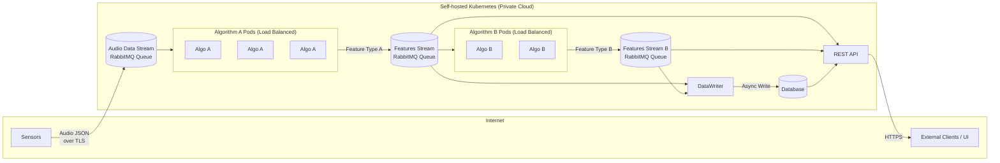
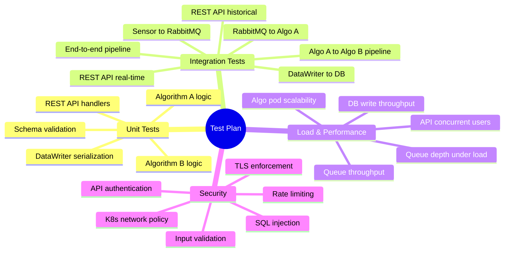
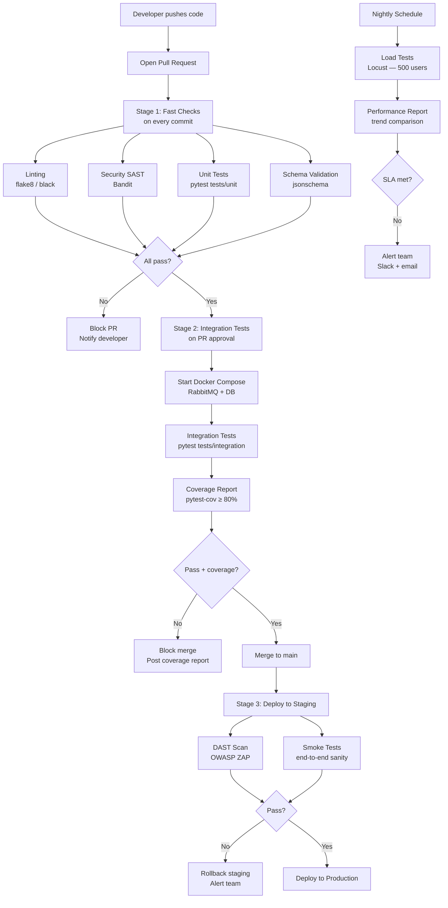
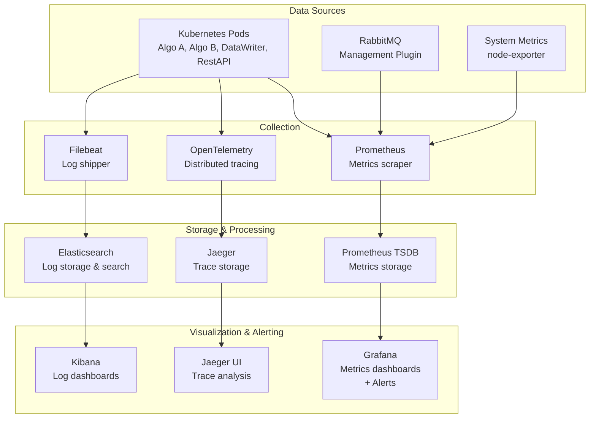

# Test Design — Audio Processing System

## System Overview

The system under test is a distributed audio processing pipeline deployed on a private Kubernetes cluster. Audio is captured by sensors, transmitted through RabbitMQ message queues, processed by two sequential algorithm stages (A → B), persisted asynchronously to a database, and finally served to internet-facing clients via a REST API.



---

## 1. Types of Tests

### 1.1 Unit Tests

**What is being tested?**
Individual components in isolation — the internal logic of Algorithm A, Algorithm B, DataWriter serialization, REST API route handlers, message schema validators, and sensor message formatting. Each unit is tested with all external dependencies (queues, DB, network) mocked or stubbed.

**Why is it important?**
Unit tests are the fastest feedback loop in the test pyramid. They verify that each component's logic is correct before integration, making defects cheap to catch and easy to localize. In a pipeline like this — where a bug in Algorithm A's output format will propagate silently through Algorithm B and into the DB — catching schema errors at the unit level is critical.

**Expected outcomes:**
- Each function produces the correct output for a given input
- Edge cases (empty audio, malformed JSON, null fields) are handled without exceptions
- Output schemas (Feature A, Feature B) conform to their specifications
- No regressions on algorithm logic after code changes

---

### 1.2 Integration Tests

**What is being tested?**
The interactions between components: sensor → RabbitMQ, RabbitMQ → Algorithm A → Features Stream, Algorithm B → DataWriter → DB, and the REST API fetching from both the queue cache and the database. These tests verify that contracts between components (message formats, queue names, DB schemas) are honoured in practice.

**Why is it important?**
Each component may work correctly in isolation but fail when combined — due to serialization mismatches, connection handling bugs, timing issues, or incorrect queue bindings. Integration tests catch the gaps that unit tests cannot.

**Expected outcomes:**
- A message published to the audio queue is consumed by Algorithm A and a valid Feature A message appears on the Features Stream
- Feature A messages are consumed by Algorithm B and valid Feature B messages are produced
- All features written by DataWriter are retrievable from the DB with correct content and timestamps
- REST API `/features/realtime` returns data sourced from the live queue cache
- REST API `/features/historical` returns correct data from the DB for the queried time range
- End-to-end: a sensor message results in queryable features from the REST API

---

### 1.3 Load & Performance Tests

**What is being tested?**
System behaviour under realistic and peak-load conditions:
- Message throughput on the audio queue
- Algorithm A and B processing latency and pod scalability
- Queue depth growth under sustained input rate
- REST API response time under concurrent client connections
- DataWriter DB write throughput and backpressure handling

**Why is it important?**
The pipeline is inherently asynchronous and distributed. Under load, queues can back up, pods can become starved, DB writes can fall behind, and the REST API real-time cache can serve stale data. Performance issues only manifest at scale and must be discovered before production.

**Expected outcomes:**
- Audio queue processing lag stays below a defined SLA (e.g., < 2 seconds at peak sensor rate)
- Algorithm A and B pods maintain throughput proportional to replica count (linear scalability)
- REST API p99 response time remains under 500 ms at 500 concurrent users
- DataWriter does not drop messages under burst load; the DB eventually becomes consistent
- No memory leaks or resource exhaustion observed over sustained test runs

---

### 1.4 Security Tests

**What is being tested?**
- Authentication and authorization on all REST API endpoints
- Transport security (TLS) for sensor-to-RabbitMQ and client-to-REST API channels
- Input validation against malformed, oversized, or injected payloads
- SQL/NoSQL injection in historical query parameters (`start`, `end`, filters)
- Rate limiting and DoS resilience on the REST API
- Secrets and credentials management (RabbitMQ credentials, DB passwords, API keys)
- Kubernetes network policy enforcement (internal services not reachable from internet)

**Why is it important?**
The system receives data from distributed sensors over a network and exposes results to external internet clients — both are high-risk attack surfaces. A compromised RabbitMQ connection could allow message injection. An unsecured REST API could leak sensitive audio features or enable DB exfiltration. Kubernetes misconfiguration could expose internal services directly.

**Expected outcomes:**
- Unauthenticated API requests return `401 Unauthorized`
- Requests with invalid tokens return `403 Forbidden`
- Injected SQL strings in query parameters do not affect DB queries; returns `400 Bad Request`
- Oversized or malformed JSON payloads are rejected at the API gateway before processing
- All external traffic uses TLS 1.2+; plaintext connections are refused
- Rate limiting returns `429 Too Many Requests` after threshold is exceeded
- Internal services (RabbitMQ, DB) are not reachable from outside the Kubernetes cluster

---

### 1.5 Manual vs. Automated Tests

| Category | Approach | Rationale |
|---|---|---|
| Unit tests | Fully automated | Run on every commit; fast, deterministic |
| Integration tests | Fully automated | Run on every PR; require infrastructure but scripted |
| Load & performance | Automated (scheduled) | Run nightly or pre-release; requires dedicated environment |
| Security — SAST/DAST | Automated (CI pipeline) | Tools like Bandit, OWASP ZAP run without human input |
| Security — penetration testing | Manual | Requires human creativity; run per major release |
| Exploratory testing | Manual | Discover unexpected behaviours; run per sprint |
| REST API contract review | Manual (initially) | Define contracts; then automate with schema validation |
| Kubernetes config review | Manual | Infrastructure-as-code review; run on infra changes |

---

## 2. Coverage Matrix

The following matrix maps every system component to the test types that apply to it.

| Component | Unit | Integration | Load | Security |
|---|:---:|:---:|:---:|:---:|
| Sensor — message formatting & transmission | ✓ | ✓ | ✓ | ✓ |
| RabbitMQ — queue configuration & bindings | — | ✓ | ✓ | ✓ |
| Algorithm A pods — audio processing logic | ✓ | ✓ | ✓ | — |
| Algorithm A — output schema (Feature A) | ✓ | ✓ | — | — |
| Algorithm B pods — feature processing logic | ✓ | ✓ | ✓ | — |
| Algorithm B — output schema (Feature B) | ✓ | ✓ | — | — |
| DataWriter — async write & error handling | ✓ | ✓ | ✓ | ✓ |
| Database — schema, queries, consistency | ✓ | ✓ | ✓ | ✓ |
| REST API — real-time endpoint | ✓ | ✓ | ✓ | ✓ |
| REST API — historical endpoint | ✓ | ✓ | ✓ | ✓ |
| REST API — authentication & authorization | ✓ | ✓ | — | ✓ |
| External client access (HTTPS, internet) | — | ✓ | ✓ | ✓ |
| Kubernetes network policies | — | ✓ | — | ✓ |

---

## 3. Test Objectives Summary



---

## 4. Automation Strategy

### 4.1 Tools

| Layer | Tool | Purpose |
|---|---|---|
| Unit & Integration | `pytest` | Primary test runner |
| Async support | `pytest-asyncio` | Testing async code (DataWriter, queue consumers) |
| HTTP testing | `pytest` + `requests` / Flask test client | REST API endpoint tests |
| RabbitMQ | `pika` | Integration tests with a real or containerised broker |
| Load testing | `Locust` | Simulate concurrent API clients and sensor publishers |
| Security scanning | `Bandit` | Static analysis for Python security issues |
| API security | `OWASP ZAP` (CLI mode) | DAST against the REST API |
| Schema validation | `jsonschema` | Validate Feature A/B message schemas |
| Mocking | `unittest.mock` / `pytest-mock` | Isolate dependencies in unit tests |
| Coverage | `pytest-cov` | Enforce minimum code coverage thresholds |
| Reporting | `pytest-html` / `allure-pytest` | Human-readable test reports |
| Containerisation | `Docker` + `docker-compose` | Spin up RabbitMQ, DB for local integration tests |

---

### 4.2 Which Tests to Automate

**Automate fully:**
- All unit tests (run on every commit, < 30 seconds total)
- All integration tests (run on every PR, using Docker Compose for dependencies)
- Schema validation tests (run on every commit)
- Load tests (run nightly in a dedicated environment)
- SAST security scans with Bandit (run on every commit)
- DAST scans with OWASP ZAP (run on every deployment to staging)

**Keep manual:**
- Penetration testing (per major release)
- Kubernetes network policy audits (per infrastructure change)
- Exploratory REST API testing (per sprint)

---

### 4.3 Example Test Scenarios

The scenarios below describe what each test category covers. Runnable implementations are in the `tests/` directory.

#### Unit Tests — Algorithm A

| Scenario | Input | Expected outcome |
|---|---|---|
| Valid audio message | JSON with `sensor_id`, `timestamp`, `audio_data` | Returns Feature A with correct schema |
| Missing required field | JSON without `audio_data` | Raises `ValueError` |
| Empty audio data | `audio_data: ""` | Raises `ValueError` |
| Invalid timestamp format | Malformed ISO-8601 string | Raises `ValueError` |
| Idempotency | Same message processed twice | Produces identical Feature A output both times |

#### Unit Tests — Algorithm B

| Scenario | Input | Expected outcome |
|---|---|---|
| Valid Feature A message | Correct Feature A schema | Returns Feature B with correct schema |
| Feature A with missing fields | Incomplete Feature A | Raises `ValueError` |
| Feature type mismatch | Feature B message passed as input | Raises `TypeError` |

#### Unit Tests — DataWriter

| Scenario | Input | Expected outcome |
|---|---|---|
| Write Feature A | Valid Feature A message | Record persisted to DB with correct fields |
| Write Feature B | Valid Feature B message | Record persisted to DB with correct fields |
| DB unavailable | Simulate connection failure | Message is not lost; retry or dead-letter |
| Duplicate message | Same message ID twice | Only one record written (idempotency) |

#### Unit Tests — REST API handlers

| Scenario | Request | Expected outcome |
|---|---|---|
| Real-time endpoint — valid token | `GET /features/realtime` with valid auth | `200` with Feature A+B list from local cache |
| Historical endpoint — valid range | `GET /features/historical?start=...&end=...` | `200` with features from DB in range |
| Historical endpoint — invalid range | `start` after `end` | `400 Bad Request` |
| Missing authentication | No `Authorization` header | `401 Unauthorized` |
| Invalid token | Expired or malformed token | `403 Forbidden` |

#### Integration Tests — pipeline

| Scenario | Steps | Expected outcome |
|---|---|---|
| Sensor → Feature A | Sensor publishes audio; Algo A consumes | Feature A appears on Features Stream queue |
| Feature A → Feature B | Algo A output consumed by Algo B | Feature B appears on output queue |
| Features → DB | DataWriter consumes both queues | Both Feature A and B records present in DB |
| Full end-to-end | Sensor publishes; all stages run | Feature queryable via REST API real-time and historical endpoints |
| Multi-pod consumption | 3 Algo A instances, 100 messages | All 100 messages processed exactly once (no duplicates, no drops) |

#### Load Tests — REST API (Locust)

| Scenario | Configuration | Pass criterion |
|---|---|---|
| Baseline throughput | 50 users, 2 min ramp-up | p99 < 200 ms, error rate < 0.1% |
| Peak load | 500 users, 5 min sustained | p99 < 500 ms, error rate < 1% |
| Spike test | 0 → 1000 users in 30 s | No crashes; graceful degradation, `429` under excess load |
| Endurance test | 200 users, 60 min | No memory growth, no error rate increase over time |

#### Security Tests

| Scenario | Method | Expected outcome |
|---|---|---|
| No auth token | `GET /features/realtime` (no header) | `401 Unauthorized` |
| Invalid/expired token | `GET /features/realtime` (bad token) | `403 Forbidden` |
| SQL injection in query param | `start=' OR '1'='1` | `400 Bad Request`; DB unaffected |
| Oversized JSON payload | POST with 10 MB body | `413 Payload Too Large` |
| Rate limit enforcement | 200 rapid requests from one client | `429 Too Many Requests` after threshold |
| HTTPS-only access | Attempt plaintext HTTP connection | Connection refused or redirected to HTTPS |
| Internal service exposure | Attempt to reach RabbitMQ/DB from outside cluster | Connection refused; no response |

---

## 5. CI/CD Integration

### 5.1 Pipeline Overview



### 5.2 GitHub Actions Workflow Structure

```yaml
# .github/workflows/ci.yml (simplified structure)

name: CI Pipeline

on:
  push:
    branches: [main, develop]
  pull_request:
    branches: [main]
  schedule:
    - cron: '0 2 * * *'   # Nightly at 02:00 UTC

jobs:
  fast-checks:
    runs-on: ubuntu-latest
    steps:
      - uses: actions/checkout@v4
      - name: Lint (flake8 + black)
      - name: SAST scan (Bandit)
      - name: Unit tests (pytest tests/unit --cov --cov-fail-under=80)
      - name: Schema validation

  integration-tests:
    needs: fast-checks
    runs-on: ubuntu-latest
    services:
      rabbitmq:
        image: rabbitmq:3-management
      postgres:
        image: postgres:15
    steps:
      - name: Run integration tests (pytest tests/integration)
      - name: Upload coverage report (artifact + PR comment)

  security-scan:
    needs: integration-tests
    if: github.event_name == 'pull_request'
    steps:
      - name: OWASP ZAP baseline scan against staging URL

  load-tests:
    if: github.event_name == 'schedule'
    runs-on: ubuntu-latest
    steps:
      - name: Run Locust (headless, 500 users, 5 min)
      - name: Assert p99 < 500ms, failure rate < 1%
      - name: Upload Locust HTML report
      - name: Notify Slack on SLA breach
```

### 5.3 Test Reporting and Alerts

| Event | Report | Alert channel |
|---|---|---|
| Unit/integration test failure on PR | GitHub PR check fails; pytest-html report uploaded as artifact | GitHub PR comment with failure summary |
| Coverage below threshold | PR blocked; coverage diff posted as comment | PR comment |
| Staging DAST finding | ZAP HTML report as artifact | Slack `#security-alerts` |
| Load test SLA breach | Locust HTML report + trend chart | Slack `#performance-alerts` + email |
| Nightly test failure | Full report in GitHub Actions summary | Slack `#qa-alerts` |

---

## 6. Logging & Visualization Tools

### 6.1 Recommended Stack



### 6.2 Tool Roles

| Tool | Role | QA Value |
|---|---|---|
| **ELK Stack** (Elasticsearch + Logstash + Kibana) | Centralised log aggregation and search | Correlate errors across pods; trace a single audio message through all processing stages by `sensor_id` and `timestamp` |
| **Prometheus** | Metrics collection from all services | Track queue depth, message processing rate, pod CPU/memory, API request rate and latency |
| **Grafana** | Metrics visualisation and alerting | Dashboards for queue lag, algorithm throughput, DB write latency, API p99; fire alerts when SLAs are breached |
| **Jaeger / OpenTelemetry** | Distributed tracing | Trace a message end-to-end from sensor → Algo A → Algo B → DataWriter → DB → REST API; identify latency bottlenecks across service boundaries |
| **RabbitMQ Management Plugin** | Queue-level metrics | Monitor queue depth, consumer count, message rates, unacknowledged messages per queue |
| **Kubernetes Dashboard / Lens** | Pod and cluster health | Observe pod restarts, OOM kills, resource limits; correlate infra events with test failures |

### 6.3 Key Metrics to Monitor During QA

| Metric | Source | Alert threshold |
|---|---|---|
| Audio queue depth | RabbitMQ | > 10,000 messages |
| Features queue depth | RabbitMQ | > 5,000 messages |
| Algo A processing latency (p99) | Prometheus | > 1,000 ms |
| Algo B processing latency (p99) | Prometheus | > 1,000 ms |
| DataWriter write lag | Prometheus | > 30 seconds behind queue |
| REST API response time (p99) | Prometheus | > 500 ms |
| REST API error rate | Prometheus | > 1% of requests |
| Pod restart count | Kubernetes | > 2 restarts in 10 minutes |
| DB connection pool utilisation | Prometheus | > 80% |
