# Test Design — Audio Processing System

## System Overview

The system under test is a distributed audio processing pipeline deployed on a private Kubernetes cluster. Audio is captured by sensors, transmitted through RabbitMQ message queues, processed by two sequential algorithm stages (A → B), persisted asynchronously to a database, and finally served to internet-facing clients via a REST API.


### Key Architectural Risks from a QA Perspective

The distributed nature of the pipeline introduces failure modes that are invisible to any single component's unit tests. The table below maps each risk to the component responsible and the test type that specifically catches it.

| Risk | Component | Potential Failure Mode | Test Type That Catches It |
|---|---|---|---|
| Message loss during broker restart | RabbitMQ | Unacknowledged messages dropped | Integration (real) |
| Silent schema drift between AlgoA output and AlgoB input | AlgoA/B boundary | TypeError at runtime, data loss | Contract tests |
| Duplicate feature writes under at-least-once delivery | DataWriter | Inflated DB record count | Unit (idempotency) |
| Queue backpressure when sensors burst | Audio Stream queue | Queue grows unboundedly, OOM | Load tests |
| Unauthenticated access to historical features | REST API | Data exfiltration | Security tests |
| Real-time cache serving stale data | REST API cache | Features older than X minutes returned | Integration tests |
| Pod crash mid-processing leaves message unacknowledged | AlgoA/B pods | Message redelivered and double-processed | Chaos tests |

---

## 1. Types of Tests

### 1.1 Unit Tests

**What is being tested?**
Individual components in isolation — the internal logic of Algorithm A, Algorithm B, DataWriter serialization, REST API route handlers, message schema validators, and sensor message formatting. Each unit is tested with all external dependencies (queues, DB, network) mocked or stubbed.

**Why is it important?**
Unit tests are the fastest feedback loop in the test pyramid. They verify that each component's logic is correct before integration, making defects cheap to catch and easy to localize. In a pipeline like this — where a bug in Algorithm A's output format will propagate silently through Algorithm B and into the DB — catching schema errors at the unit level is critical.

**Expected outcomes:**
- Each function produces the correct output for a given input
- Edge cases (empty audio, malformed JSON, null fields) are handled without exceptions
- Output schemas (Feature A, Feature B) conform to their specifications
- No regressions on algorithm logic after code changes

**Test Isolation Strategy:**
All unit tests use the `InMemoryBroker` adapter, which implements the exact same interface as the real RabbitMQ broker (`RealBroker`). This allows every component — Algorithm A, Algorithm B, DataWriter, and the Sensor — to be tested in complete isolation without any network calls, Docker containers, or external processes running. Swapping the broker implementation is the Adapter Pattern applied directly to testability: the production code never changes, only the injected dependency does.

#### Unit Test Coverage Targets

| Module | Target Coverage | Current Test Count | Key Scenarios |
|---|:---:|:---:|---|
| `mocks/algorithm_a.py` | ≥ 90% | 23 tests | Valid input, missing fields, empty audio, invalid timestamp, deterministic output, broker interaction |
| `mocks/algorithm_b.py` | ≥ 90% | 23 tests | Valid Feature A input, wrong feature type, missing fields, fanout publish |
| `mocks/data_writer.py` | ≥ 85% | 16 tests | `flush()` correctness, idempotency, query filters (type / sensor / time range) |
| `mocks/rest_api.py` | ≥ 85% | 22 tests | Auth, realtime cache, historical range, error handling |
| `mocks/sensor.py` | ≥ 80% | 10 tests | `sensor_id` generation, message schema, base64 encoding, queue depth |
| `mocks/rabbitmq.py` | ≥ 85% | 12 tests | Work queue depth, fanout subscriber count, `purge_all`, timeout consume |

---

### 1.2 Integration Tests

**What is being tested?**
The interactions between components: sensor → RabbitMQ, RabbitMQ → Algorithm A → Features Stream, Algorithm B → DataWriter → DB, and the REST API fetching from both the queue cache and the database. These tests verify that contracts between components (message formats, queue names, DB schemas) are honoured in practice.

**Why is it important?**
Each component may work correctly in isolation but fail when combined — due to serialization mismatches, connection handling bugs, timing issues, or incorrect queue bindings. Integration tests catch the gaps that unit tests cannot.

**Expected outcomes:**
- A message published to the audio queue is consumed by Algorithm A and a valid Feature A message appears on the Features Stream
- Feature A messages are consumed by Algorithm B and valid Feature B messages are produced
- All features written by DataWriter are retrievable from the DB with correct content and timestamps
- REST API `/features/realtime` returns data sourced from the live queue cache
- REST API `/features/historical` returns correct data from the DB for the queried time range
- End-to-end: a sensor message results in queryable features from the REST API

**Component Contract Boundaries:**

Each arrow in the pipeline represents a contract — a promise about message shape that the producer must honour and the consumer must be able to rely on. A silent violation at any boundary causes data loss or runtime errors with no helpful error message.

```
┌─────────────────────────────────────────────────────────────────────────────┐
│                     Pipeline Contract Boundaries                            │
└─────────────────────────────────────────────────────────────────────────────┘

  [Sensor]                [AlgorithmA]              [AlgorithmB]
     │                        │                          │
     │  ① Audio Message       │  ② Feature A Message     │  ③ Feature B Message
     │  ─────────────────►    │  ──────────────────►     │  ──────────────────►
     │  {                     │  {                        │  {
     │    message_id,         │    message_id,            │    message_id,
     │    sensor_id,          │    source_message_id,     │    source_message_id,
     │    timestamp,          │    feature_type: "A",     │    feature_type: "B",
     │    audio_data (b64)    │    sensor_id,             │    sensor_id,
     │  }                     │    timestamp,             │    timestamp,
     │                        │    processed_at,          │    processed_at,
     │                        │    features: {            │    features: {
     │                        │      mfcc[13],            │      classification,
     │                        │      spectral_centroid,   │      confidence,
     │                        │      zero_crossing_rate,  │      derived_metrics
     │                        │      rms_energy           │    }
     │                        │    }                      │  }
     │                        │  }                        │
     │                        │                          [DataWriter / DB]
     │                        │                               │
     │                        │      ④ DB Record              │
     │                        │  ────────────────────────────►│
     │                        │  Row: all Feature A/B fields  │
     │                        │  preserved with full fidelity │
     └────────────────────────┴───────────────────────────────┘

  Contract tests (tests/contract/) verify each of these 4 boundaries automatically.
```

**In-Memory vs. Real-Service Integration:**

| Test scope | Infrastructure | Location | When it runs |
|---|---|---|---|
| In-memory pipeline (all stages wired) | `InMemoryBroker` only — no Docker | `tests/integration/` | Every PR, < 5 s |
| Real AMQP + PostgreSQL | Docker Compose / GitHub Actions service containers | `tests/integration_real/` | Every PR (CI services job) |

---

### 1.3 Contract Tests

**What is being tested?**
The exact message schema produced at each pipeline boundary. Unlike integration tests (which verify behaviour), contract tests verify the *shape* of every message — field presence, types, value constraints, and lineage (e.g. `sensor_id` must be identical from the original audio message all the way through to the final DB record).

**Why is it important?**
In a distributed system with independently deployed services, a schema change in Algorithm A's output that is not reflected in Algorithm B's parser causes a silent `TypeError` or `KeyError` at runtime — not at deploy time. Contract tests provide a safety net that is checked on every commit, catching these regressions instantly.

**Contract test classes (`tests/contract/test_message_contracts.py`):**

| Class | Boundary tested | Test count |
|---|---|---|
| `TestAudioMessageContract` | Sensor → AlgorithmA | 4 tests |
| `TestFeatureAContract` | AlgorithmA → AlgorithmB | 7 tests |
| `TestFeatureBContract` | AlgorithmB → DataWriter / REST API | 6 tests |
| `TestDataWriterDatabaseContract` | DataWriter → DB read/write roundtrip | 5 tests |

**Expected outcomes:**
- All required fields are present in every outbound message
- `feature_type` is exactly `"A"` or `"B"` at each stage
- MFCC list is always exactly 13 coefficients
- `sensor_id` lineage is preserved end-to-end (Sensor → AlgoA → AlgoB → DB)
- Nested `features` dicts survive a DB write→query roundtrip with identical content
- Timestamps are valid ISO-8601 strings throughout the pipeline

---

### 1.4 Chaos / Resilience Tests

**What is being tested?**
System behaviour under deliberately introduced failure conditions: malformed messages, duplicate delivery, concurrent writes, mid-processing queue purges, and zero-subscriber fanout publishes. The goal is to verify *graceful degradation* — the system must never silently corrupt data or crash the caller.

**Why is it important?**
At-least-once delivery guarantees from RabbitMQ mean duplicates will arrive. Sensor firmware bugs will produce malformed messages. Pod crashes mid-processing are a normal Kubernetes event. Chaos tests ensure the system handles all of these without data loss or a cascading failure.

**Chaos test classes (`tests/chaos/test_resilience.py`):**

| Class | Failure mode simulated | Test count |
|---|---|---|
| `TestBrokerResilienceUnderMalformedMessages` | Missing fields, wrong `feature_type`, empty dict write | 3 tests |
| `TestDataWriterIdempotencyUnderStress` | 100× duplicate delivery, 5 concurrent `flush()` calls, 50 flush cycles | 3 tests |
| `TestQueueBehaviourUnderEdgeCases` | Empty queue, mid-flight `purge_all()`, zero-subscriber fanout | 3 tests |

**Expected outcomes:**
- A malformed message in the queue does not prevent subsequent valid messages from being processed
- Idempotency holds under 100 duplicate deliveries: exactly 1 DB record
- Concurrent `flush()` calls do not create duplicate DB records
- `process_all()` on an empty broker returns 0 without raising
- Broker is fully functional after `purge_all()` — publish and consume still work

---

### 1.5 Load & Performance Tests

**What is being tested?**
System behaviour under realistic and peak-load conditions:
- Message throughput on the audio queue
- Algorithm A and B processing latency and pod scalability
- Queue depth growth under sustained input rate
- REST API response time under concurrent client connections
- DataWriter DB write throughput and backpressure handling

**Why is it important?**
The pipeline is inherently asynchronous and distributed. Under load, queues can back up, pods can become starved, DB writes can fall behind, and the REST API real-time cache can serve stale data. Performance issues only manifest at scale and must be discovered before production.

**Expected outcomes:**
- Audio queue processing lag stays below a defined SLA (e.g., < 2 seconds at peak sensor rate)
- Algorithm A and B pods maintain throughput proportional to replica count (linear scalability)
- REST API p99 response time remains under 500 ms at 500 concurrent users
- DataWriter does not drop messages under burst load; the DB eventually becomes consistent
- No memory leaks or resource exhaustion observed over sustained test runs

**SLA Thresholds (in-memory baseline):**

| Metric | SLA threshold | Measured by |
|---|---|---|
| AlgorithmA single-pod throughput | ≥ 100 messages / second | `TestAudioQueueThroughput` |
| End-to-end pipeline latency p99 | ≤ 2 000 ms | `TestEndToEndPipelineLatency` |
| DataWriter flush rate | ≥ 50 features / second | `TestDataWriterThroughput` |
| REST API p99 (both endpoints) | ≤ 500 ms | `TestRestApiResponseTime` |
| Message loss under burst | 0 (zero tolerance) | `TestQueueBackpressure` |
| Multi-pod deduplication correctness | 0 duplicate DB records | `TestMultiPodScalability` |

---

### 1.6 Security Tests

**What is being tested?**
- Authentication and authorization on all REST API endpoints
- Transport security (TLS) for sensor-to-RabbitMQ and client-to-REST API channels
- Input validation against malformed, oversized, or injected payloads
- SQL/NoSQL injection in historical query parameters (`start`, `end`, filters)
- Rate limiting and DoS resilience on the REST API
- Secrets and credentials management (RabbitMQ credentials, DB passwords, API keys)
- Kubernetes network policy enforcement (internal services not reachable from internet)

**Why is it important?**
The system receives data from distributed sensors over a network and exposes results to external internet clients — both are high-risk attack surfaces. A compromised RabbitMQ connection could allow message injection. An unsecured REST API could leak sensitive audio features or enable DB exfiltration. Kubernetes misconfiguration could expose internal services directly.

**Expected outcomes:**
- Unauthenticated API requests return `401 Unauthorized`
- Requests with invalid tokens return `403 Forbidden`
- Injected SQL strings in query parameters do not affect DB queries; returns `400 Bad Request`
- Oversized or malformed JSON payloads are rejected at the API gateway before processing
- All external traffic uses TLS 1.2+; plaintext connections are refused
- Rate limiting returns `429 Too Many Requests` after threshold is exceeded
- Internal services (RabbitMQ, DB) are not reachable from outside the Kubernetes cluster

---

### 1.7 Manual vs. Automated Tests

| Category | Approach | Rationale |
|---|---|---|
| Unit tests | Fully automated | Run on every commit; fast, deterministic |
| Contract tests | Fully automated | Run on every PR; zero-infrastructure, < 2 s |
| Chaos / resilience tests | Fully automated | Run on every PR; in-memory, no Docker required |
| Integration tests | Fully automated | Run on every PR; require infrastructure but scripted |
| Load & performance | Automated (scheduled) | Run nightly or pre-release; requires dedicated environment |
| Security — SAST/DAST | Automated (CI pipeline) | Tools like Bandit, OWASP ZAP run without human input |
| Security — penetration testing | Manual | Requires human creativity; run per major release |
| Exploratory testing | Manual | Discover unexpected behaviours; run per sprint |
| REST API contract review | Manual (initially) | Define contracts; then automate with schema validation |
| Kubernetes config review | Manual | Infrastructure-as-code review; run on infra changes |

---

## 2. Coverage Matrix

The following matrix maps every system component to the test types that apply to it.

| Component | Unit | Integration | Contract | Chaos | Load | Security |
|---|:---:|:---:|:---:|:---:|:---:|:---:|
| Sensor — message formatting & transmission | ✓ | ✓ | ✓ | — | ✓ | ✓ |
| RabbitMQ — queue configuration & bindings | — | ✓ | — | ✓ | ✓ | ✓ |
| Algorithm A pods — audio processing logic | ✓ | ✓ | ✓ | ✓ | ✓ | — |
| Algorithm A — output schema (Feature A) | ✓ | ✓ | ✓ | — | — | — |
| Algorithm B pods — feature processing logic | ✓ | ✓ | ✓ | ✓ | ✓ | — |
| Algorithm B — output schema (Feature B) | ✓ | ✓ | ✓ | — | — | — |
| DataWriter — async write & error handling | ✓ | ✓ | ✓ | ✓ | ✓ | ✓ |
| Database — schema, queries, consistency | ✓ | ✓ | ✓ | — | ✓ | ✓ |
| REST API — real-time endpoint | ✓ | ✓ | — | — | ✓ | ✓ |
| REST API — historical endpoint | ✓ | ✓ | — | — | ✓ | ✓ |
| REST API — authentication & authorization | ✓ | ✓ | — | — | — | ✓ |
| External client access (HTTPS, internet) | — | ✓ | — | — | ✓ | ✓ |
| Kubernetes network policies | — | ✓ | — | — | — | ✓ |
| Message idempotency / deduplication | ✓ | ✓ | — | ✓ | ✓ | — |
| Broker fanout delivery semantics | — | ✓ | ✓ | ✓ | — | — |

---

## 3. Test Objectives Summary

```mermaid
flowchart LR
    TP(["🗂 Test Plan"])

    subgraph UT ["Unit Tests"]
        UA["Algorithm A logic"]
        UB["Algorithm B logic"]
        UD["DataWriter serialization"]
        UR["REST API handlers"]
        US["Schema validation"]
    end

    subgraph CT ["Contract Tests"]
        C1["Sensor → AlgoA boundary"]
        C2["AlgoA → AlgoB boundary"]
        C3["AlgoB → DataWriter boundary"]
        C4["DB read/write roundtrip"]
    end

    subgraph CH ["Chaos Tests"]
        CH1["Malformed message resilience"]
        CH2["Idempotency under stress"]
        CH3["Queue edge cases"]
    end

    subgraph IT ["Integration Tests"]
        IS["Sensor → RabbitMQ"]
        IA["RabbitMQ → Algo A"]
        IAB["Algo A → Algo B pipeline"]
        ID["DataWriter → DB"]
        IR["REST API real-time"]
        IH["REST API historical"]
        IE["End-to-end pipeline"]
    end

    subgraph LP ["Load & Performance"]
        LQ["Queue throughput"]
        LS["Algo pod scalability"]
        LD["DB write throughput"]
        LA["API concurrent users"]
        LQD["Queue depth under load"]
    end

    subgraph ST ["Security"]
        SA["API authentication"]
        TL["TLS enforcement"]
        IV["Input validation"]
        SI["SQL injection"]
        RL["Rate limiting"]
        KN["K8s network policy"]
    end

    TP --> UT
    TP --> CT
    TP --> CH
    TP --> IT
    TP --> LP
    TP --> ST
```



---

## 4. Automation Strategy

### 4.1 Tools

| Layer | Tool | Purpose |
|---|---|---|
| Unit & Integration | `pytest` | Primary test runner |
| Async support | `pytest-asyncio` | Testing async code (DataWriter, queue consumers) |
| HTTP testing | `pytest` + `requests` / Flask test client | REST API endpoint tests |
| RabbitMQ | `pika` | Integration tests with a real or containerised broker |
| Load testing | `Locust` | Simulate concurrent API clients and sensor publishers |
| Load testing (pipeline) | `pytest` throughput suite | In-process SLA-gated throughput, latency, backpressure tests |
| Security scanning | `Bandit` | Static analysis for Python security issues |
| API security | `OWASP ZAP` (CLI mode) | DAST against the REST API |
| Schema validation | `jsonschema` | Validate Feature A/B message schemas |
| Contract testing | `pytest` + custom assertions | Verify message schema at every pipeline boundary |
| Chaos testing | `pytest` + direct broker manipulation | Inject failures and verify graceful degradation |
| Mocking | `unittest.mock` / `pytest-mock` | Isolate dependencies in unit tests |
| Coverage | `pytest-cov` | Enforce minimum code coverage thresholds |
| Reporting | `pytest-html` / `allure-pytest` | Human-readable test reports |
| Containerisation | `Docker` + `docker-compose` | Spin up RabbitMQ, DB for local integration tests |
| Formatting | `black` | Enforce consistent code style across all files |
| Linting | `flake8` | Catch unused imports, undefined names, style violations |

---

### 4.2 Which Tests to Automate

**Automate fully:**
- All unit tests (run on every commit, < 5 seconds total)
- All contract tests (run on every commit, zero infrastructure required)
- All chaos / resilience tests (run on every PR, in-memory broker, no Docker)
- All integration tests (run on every PR, using Docker Compose for dependencies)
- Schema validation tests (run on every commit)
- Load tests (run nightly in a dedicated environment)
- SAST security scans with Bandit (run on every commit)
- DAST scans with OWASP ZAP (run on every deployment to staging)

**Keep manual:**
- Penetration testing (per major release)
- Kubernetes network policy audits (per infrastructure change)
- Exploratory REST API testing (per sprint)

---

### 4.3 Example Test Scenarios

The scenarios below describe what each test category covers. Runnable implementations are in the `tests/` directory.

#### Unit Tests — Algorithm A

| Scenario | Input | Expected outcome |
|---|---|---|
| Valid audio message | JSON with `sensor_id`, `timestamp`, `audio_data` | Returns Feature A with correct schema |
| Missing required field | JSON without `audio_data` | Raises `ValueError` |
| Empty audio data | `audio_data: ""` | Raises `ValueError` |
| Invalid timestamp format | Malformed ISO-8601 string | Raises `ValueError` |
| Idempotency | Same message processed twice | Produces identical Feature A output both times |

#### Unit Tests — Algorithm B

| Scenario | Input | Expected outcome |
|---|---|---|
| Valid Feature A message | Correct Feature A schema | Returns Feature B with correct schema |
| Feature A with missing fields | Incomplete Feature A | Raises `ValueError` |
| Feature type mismatch | Feature B message passed as input | Raises `TypeError` |

#### Unit Tests — DataWriter

| Scenario | Input | Expected outcome |
|---|---|---|
| Write Feature A | Valid Feature A message | Record persisted to DB with correct fields |
| Write Feature B | Valid Feature B message | Record persisted to DB with correct fields |
| DB unavailable | Simulate connection failure | Message is not lost; retry or dead-letter |
| Duplicate message | Same message ID twice | Only one record written (idempotency) |

#### Unit Tests — REST API handlers

| Scenario | Request | Expected outcome |
|---|---|---|
| Real-time endpoint — valid token | `GET /features/realtime` with valid auth | `200` with Feature A+B list from local cache |
| Historical endpoint — valid range | `GET /features/historical?start=...&end=...` | `200` with features from DB in range |
| Historical endpoint — invalid range | `start` after `end` | `400 Bad Request` |
| Missing authentication | No `Authorization` header | `401 Unauthorized` |
| Invalid token | Expired or malformed token | `403 Forbidden` |

#### Contract Tests — pipeline boundaries

| Scenario | Boundary | Assertion |
|---|---|---|
| Sensor output satisfies AlgoA required fields | ① Sensor → AlgoA | `{"message_id", "sensor_id", "timestamp", "audio_data"}` all present |
| Sensor audio_data is valid base64 | ① Sensor → AlgoA | `base64.b64decode()` succeeds without error |
| AlgoA output satisfies AlgoB required fields | ② AlgoA → AlgoB | All 7 required Feature A fields present |
| Feature A MFCC list has exactly 13 coefficients | ② AlgoA → AlgoB | `len(features["mfcc"]) == 13` |
| AlgoB output satisfies DataWriter required fields | ③ AlgoB → DataWriter | All 7 required Feature B fields present |
| Feature B classification is a known value | ③ AlgoB → DataWriter | `classification in {"speech","music","noise","silence","mixed"}` |
| `sensor_id` lineage preserved end-to-end | ①②③ | Same `sensor_id` from audio → Feature A → Feature B → DB |
| Features dict survives DB write/query roundtrip | ④ DataWriter → DB | `written_record["features"] == original_features` |

#### Chaos Tests — failure mode scenarios

| Scenario | Failure injected | Expected outcome |
|---|---|---|
| Malformed message in queue | Dict missing `audio_data` and `timestamp` | ValueError caught; next 2 valid messages processed (successes == 2) |
| Wrong feature type in fanout | `feature_type="B"` message on `features_a` topic | TypeError caught; next 2 valid Feature A messages processed |
| Empty dict written directly to DataWriter | `data_writer._write({})` | Exception caught or silently skipped; existing DB records untouched |
| 100× duplicate delivery | Same `message_id` published 100 times | Exactly 1 DB record after flush |
| 5 concurrent flush calls | `asyncio.gather(*[flush() for _ in range(5)])` | Exactly 10 DB records — no double-writes |
| `purge_all()` mid-processing | Purge after processing 2 of 5 messages | Queue depth = 0; broker still fully usable afterwards |
| Fanout publish with zero subscribers | `publish_fanout(FEATURES_A, msg)` before any `subscribe_fanout()` | Completes silently; subsequent subscribe + publish works correctly |

#### Integration Tests — pipeline

| Scenario | Steps | Expected outcome |
|---|---|---|
| Sensor → Feature A | Sensor publishes audio; Algo A consumes | Feature A appears on Features Stream queue |
| Feature A → Feature B | Algo A output consumed by Algo B | Feature B appears on output queue |
| Features → DB | DataWriter consumes both queues | Both Feature A and B records present in DB |
| Full end-to-end | Sensor publishes; all stages run | Feature queryable via REST API real-time and historical endpoints |
| Multi-pod consumption | 3 Algo A instances, 100 messages | All 100 messages processed exactly once (no duplicates, no drops) |

#### Load Tests — REST API (Locust)

| Scenario | Configuration | Pass criterion |
|---|---|---|
| Baseline throughput | 50 users, 2 min ramp-up | p99 < 200 ms, error rate < 0.1% |
| Peak load | 500 users, 5 min sustained | p99 < 500 ms, error rate < 1% |
| Spike test | 0 → 1000 users in 30 s | No crashes; graceful degradation, `429` under excess load |
| Endurance test | 200 users, 60 min | No memory growth, no error rate increase over time |

#### Security Tests

| Scenario | Method | Expected outcome |
|---|---|---|
| No auth token | `GET /features/realtime` (no header) | `401 Unauthorized` |
| Invalid/expired token | `GET /features/realtime` (bad token) | `403 Forbidden` |
| SQL injection in query param | `start=' OR '1'='1` | `400 Bad Request`; DB unaffected |
| Oversized JSON payload | POST with 10 MB body | `413 Payload Too Large` |
| Rate limit enforcement | 200 rapid requests from one client | `429 Too Many Requests` after threshold |
| HTTPS-only access | Attempt plaintext HTTP connection | Connection refused or redirected to HTTPS |
| Internal service exposure | Attempt to reach RabbitMQ/DB from outside cluster | Connection refused; no response |

---

## 5. CI/CD Integration

### 5.0 Tool Selection — Why GitHub Actions

| Criterion | GitHub Actions | Jenkins | CircleCI | GitLab CI |
|---|---|---|---|---|
| Setup complexity | Zero — native to repo | High — self-hosted server | Low | Low (GitLab only) |
| Cost for this project | Free (public repo) | Infrastructure cost | Free tier limited | Free tier limited |
| Docker service containers | ✅ Native support | ✅ With plugins | ✅ | ✅ |
| Scheduled runs (nightly) | ✅ cron syntax | ✅ | ✅ | ✅ |
| Artifact storage | ✅ Built-in | ✅ With plugins | ✅ | ✅ |
| Slack integration | ✅ slackapi/slack-github-action | ✅ | ✅ | ✅ |
| Secret management | ✅ GitHub Secrets | ✅ Credentials store | ✅ | ✅ |
| Verdict | ✅ Selected | ❌ Overkill for this scope | ❌ Cost at scale | ❌ Wrong platform |

**Justification:** GitHub Actions was selected because the repository is already hosted on GitHub, making it the zero-friction choice — no additional servers, accounts, or integrations required. The native `services:` block provides real RabbitMQ and PostgreSQL containers for integration tests without any custom Docker orchestration. For an enterprise deployment with on-premise infrastructure requirements, Jenkins would be the appropriate alternative.

### 5.1 Pipeline Overview

```mermaid
flowchart TD
    DEV[Developer pushes code] --> PR[Open Pull Request]

    PR --> STAGE1[Stage 1: Fast Checks\non every commit]
    STAGE1 --> LINT[Linting\nflake8 / black]
    STAGE1 --> SAST[Security SAST\nBandit]
    STAGE1 --> UNIT[Unit Tests\npytest tests/unit]
    STAGE1 --> SCHEMA[Schema Validation\njsonschema]

    LINT & SAST & UNIT & SCHEMA --> GATE1{All pass?}
    GATE1 -->|No| FAIL1[Block PR\nNotify developer]
    GATE1 -->|Yes| STAGE2[Stage 2: Integration + Contract + Chaos + Security\non PR approval]

    STAGE2 --> INTTEST[Integration Tests\npytest tests/integration]
    STAGE2 --> CONTRACT[Contract Tests\npytest tests/contract]
    STAGE2 --> CHAOS[Chaos Tests\npytest tests/chaos]
    STAGE2 --> SECTEST[Security Tests\npytest tests/security]
    STAGE2 --> COVERAGE[Coverage Report\npytest-cov ≥ 80%]

    INTTEST & CONTRACT & CHAOS & SECTEST & COVERAGE --> GATE2{All pass?}
    GATE2 -->|No| FAIL2[Block merge\nPost report as artifact]
    GATE2 -->|Yes| STAGE2B[Stage 2b: Real-service Tests\nRabbitMQ + PostgreSQL containers]

    STAGE2B --> REALTEST[Real-service Integration Tests\npytest tests/integration_real]
    REALTEST --> MERGE[Merge to main]

    MERGE --> STAGE3[Stage 3: Deploy to Staging]
    STAGE3 --> DAST[DAST Scan\nOWASP ZAP]
    STAGE3 --> SMOKE[Smoke Tests\nend-to-end sanity]

    DAST & SMOKE --> GATE3{Pass?}
    GATE3 -->|No| ROLLBACK[Rollback staging\nAlert team]
    GATE3 -->|Yes| DEPLOY[Deploy to Production]

    NIGHTLY[Nightly Schedule] --> LOAD[Load Tests\npytest throughput suite]
    LOAD --> PERF_REPORT[Performance Report\ntrend comparison]
    PERF_REPORT --> PERF_GATE{SLA met?}
    PERF_GATE -->|No| PERF_ALERT[Alert team\nSlack + email]
```



### 5.2 GitHub Actions Workflow Structure

The actual workflow lives at `.github/workflows/ci.yml`. The table below summarises the four jobs and their trigger conditions.

| Job | Trigger | Depends on | Key steps |
|---|---|---|---|
| `fast-checks` | Every push and PR | — | flake8, black --check, Bandit, unit tests + 80% coverage gate |
| `integration-tests` | After `fast-checks` passes | `fast-checks` | In-memory integration, contract, chaos, security tests; HTML report artifact |
| `real-service-tests` | After `fast-checks` passes | `fast-checks` | RabbitMQ 3.12 + PostgreSQL 15 service containers; `tests/integration_real/` |
| `load-tests` | Nightly schedule only (`0 2 * * *`) | — | `pytest tests/load/test_pipeline_throughput.py`; Slack alert on SLA breach |

```yaml
# .github/workflows/ci.yml (simplified structure)

name: CI Pipeline

on:
  push:
    branches: [main, develop]
  pull_request:
    branches: [main]
  schedule:
    - cron: '0 2 * * *'   # Nightly at 02:00 UTC

jobs:
  fast-checks:
    runs-on: ubuntu-latest
    steps:
      - uses: actions/checkout@v4
      - name: Lint (flake8 + black --check)
      - name: SAST scan (Bandit)
      - name: Unit tests (pytest -m unit --cov --cov-fail-under=80)

  integration-tests:
    needs: fast-checks
    runs-on: ubuntu-latest
    steps:
      - name: Integration tests  (pytest -m integration)
      - name: Contract tests     (pytest tests/contract/)
      - name: Chaos tests        (pytest tests/chaos/)
      - name: Security tests     (pytest -m security)
      - name: Upload HTML reports as artifacts

  real-service-tests:
    needs: fast-checks
    runs-on: ubuntu-latest
    services:
      rabbitmq:
        image: rabbitmq:3.12-management
      postgres:
        image: postgres:15
    steps:
      - name: Run real-service integration tests (pytest tests/integration_real)

  load-tests:
    if: github.event_name == 'schedule'
    runs-on: ubuntu-latest
    steps:
      - name: Run pytest throughput suite (SLA-gated)
      - name: Upload load test HTML report
      - name: Notify Slack on SLA breach
```

### 5.3 Test Reporting and Alerts

| Event | Report | Alert channel |
|---|---|---|
| Unit/integration test failure on PR | GitHub PR check fails; pytest-html report uploaded as artifact | GitHub PR comment with failure summary |
| Contract test failure on PR | `contract-report.html` artifact; job fails and blocks merge | GitHub PR check |
| Chaos test failure on PR | `chaos-report.html` artifact; job fails and blocks merge | GitHub PR check |
| Coverage below threshold | PR blocked; coverage diff posted as comment | PR comment |
| Staging DAST finding | ZAP HTML report as artifact | Slack `#security-alerts` |
| Load test SLA breach | Locust/pytest HTML report + trend chart | Slack `#performance-alerts` + email |
| Nightly test failure | Full report in GitHub Actions summary | Slack `#qa-alerts` |

### Test Report Visibility — Where to Find Results

| Report Type | Location in GitHub | How to Access | Available Without Download? |
|---|---|---|---|
| Unit test summary | Actions → Run → Summary tab | Automatic — written to $GITHUB_STEP_SUMMARY | ✅ Yes |
| Coverage % | Actions → Run → Summary tab | Written inline by pytest-cov | ✅ Yes |
| Full HTML test report | Actions → Run → Artifacts section | Click Download → open .html | ❌ Must download |
| Bandit SAST findings | Actions → Run → Summary tab | Written inline if issues found | ✅ Yes |
| Load test SLA result | Actions → Run → Summary tab | PASSED/BREACH written inline | ✅ Yes |
| Slack alert | #performance-alerts channel | Automatic on nightly SLA breach | ✅ Yes (Slack) |

**Report Access Flow:**

---

## 6. Logging & Visualization Tools

### 6.1 Recommended Stack


### 6.2 Tool Roles

| Tool | Role | QA Value |
|---|---|---|
| **ELK Stack** (Elasticsearch + Logstash + Kibana) | Centralised log aggregation and search | Correlate errors across pods; trace a single audio message through all processing stages by `sensor_id` and `timestamp` |
| **Prometheus** | Metrics collection from all services | Track queue depth, message processing rate, pod CPU/memory, API request rate and latency |
| **Grafana** | Metrics visualisation and alerting | Dashboards for queue lag, algorithm throughput, DB write latency, API p99; fire alerts when SLAs are breached |
| **Jaeger / OpenTelemetry** | Distributed tracing | Trace a message end-to-end from sensor → Algo A → Algo B → DataWriter → DB → REST API; identify latency bottlenecks across service boundaries |
| **RabbitMQ Management Plugin** | Queue-level metrics | Monitor queue depth, consumer count, message rates, unacknowledged messages per queue |
| **Kubernetes Dashboard / Lens** | Pod and cluster health | Observe pod restarts, OOM kills, resource limits; correlate infra events with test failures |

### 6.3 Key Metrics to Monitor During QA

| Metric | Source | Alert threshold |
|---|---|---|
| Audio queue depth | RabbitMQ | > 10,000 messages |
| Features queue depth | RabbitMQ | > 5,000 messages |
| Algo A processing latency (p99) | Prometheus | > 1,000 ms |
| Algo B processing latency (p99) | Prometheus | > 1,000 ms |
| DataWriter write lag | Prometheus | > 30 seconds behind queue |
| REST API response time (p99) | Prometheus | > 500 ms |
| REST API error rate | Prometheus | > 1% of requests |
| Pod restart count | Kubernetes | > 2 restarts in 10 minutes |
| DB connection pool utilisation | Prometheus | > 80% |
| Unacknowledged message count | RabbitMQ | > 500 per queue |
| Contract test failures (CI) | GitHub Actions | Any failure blocks merge |
| Chaos test failures (CI) | GitHub Actions | Any failure blocks merge |
